# 포트폴리오(Portfolio)

**개인 프로젝트**

---

- **Vue.js를 이용한 웹앱 버거버거(BurgerBurger)**

  -수행역할 : 아이디어 제안, 설계, 개발

  -사용기술 : 
	1) BackEnd : Spring Boot 2.1.7, Java 1.8
  	2) Front End : Vue.js, Vuetify
	3) DB : firebase firestore
  	4) library : selenium
	5) Server Env : GCP(GoogleCloudPlatform)

-selenium을 이용한 브랜드 별 홈페이지 가격정보 크롤링

-크롤링 data firestore에 저장

-브랜드 별 카테고리, 제품 조회 RestAPI 구현

-vuetify를 이용한 제품 조회 웹 앱 페이지 구현

- **하이브리드 앱 잊지말아요 그약**

  -수행역할 : 기획 및 개발

  -사용기술:

  ​	1) Framwork : 아이오닉(ionic)2

  ​	2) 언어 : Typescript, Angular js

  ​	3) DB : Device Storage

  -처방전, 알람 정보 Storage 저장

  -처방전 목록 조회

  -구글 플레이 스토어 출시

- **빅데이터 기반의 처방 스케줄링 서비스**

  (트랜드 x 메디컬 2016 해커톤 수상)

  -수행역할 : 기획 및 개발

  -사용기술 :

  ​	1) BackEnd : 전자정보프레임워크

  ​	2) Front End : Angular js, html5

  ​	3) DB : MySql

  ​	4) library : google vision API 

  -이미지 파일 테스트 변환

  -처방약 코드를 이용한 유사 처방 환자 조회 

  -처방약 이상치 분석 시각화

- **하이브리드 분석 기반의 기계 학습을 활용한 랜섬웨어 탐지 모델제안**

  -수행역할 : 연구 및 개발 

  -사용기술 : 

  ​	1) BackEnd : R, Python(numpy)

  -악성코드 분석 관련 논문 연구 

  -머신러닝 알고리즘 연구 

  -데이터 필터링 프로그램 구현 

  -Logistic Regression 모델링 프로그램 구현
  
  

**회사 프로젝트**

---

**- 보안솔루션 인증팀 (2017.01 - 현재)**

•     **서명수집분석시스템**

​	-수행역할(기여도): 개발 및 서버 구축(70%)

​	-사용기술: 

​	 	1) BackEnd: JAVA 1.7, Spring Framework 3.2.8

​	 	2) Front End: Html, javascript, jQuery, Bootstrap

​	 	3) DB: mysql

​	-앱/태블릿 서명 로그 수집 restful API 구현

​	-서명 데이터 배속 조절, 반복 재생 기능 구현(HTML5 Canvas)

​	-서명 딥러닝 학습을 위한 데이터 셋 DB 스키마 설계 

​	-서명 수집 프로파일 관리 기능 구현(CRUD)

​	-서명 길이, 시간, 획수 조회 기능 구현(서명raw데이터)

•     **전자문서 계약 데모사이트**

-수행역할(기여도): 개발(100%)

-사용기술:

  1) BackEnd: JAVA 1.7, Spring Framework 4.0, iText

  2) FrontEnd : javascript, PdfObject, Bootstrap

-서명 인증 솔루션과 연동(서명분석시스템)

-iText를 이용한 전자계약문서 PDF 파일 생성 

-Bootstrap를 이용한 화면 구성

-계약자 정보를 이용한 서명 인증

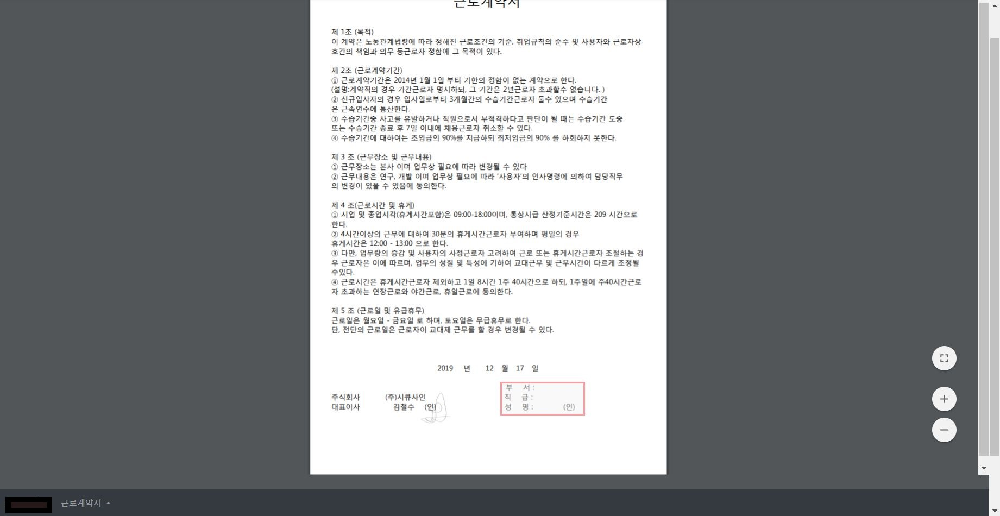

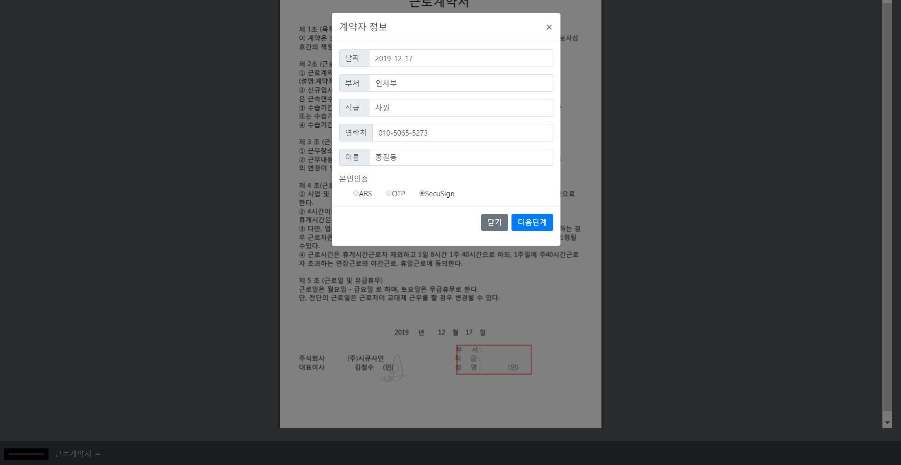

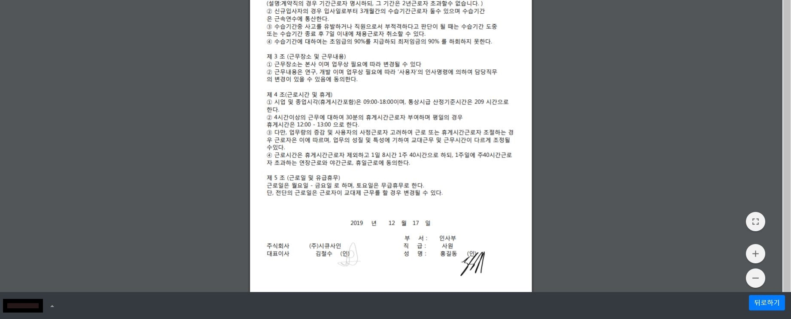

•    **조달정보시스템 노후장비 교체 및 운영환경 개선사업** 
 (스마트 나라장터 인증 강화를 위한 수기서명 SW도입)

\-   수행역할(기여도): 개발 및 서버 구축(70%)

\-   기간: 2018.01 ~ 현재

\- 사용기술:

​	1) BackEnd: JAVA 1.7, Spring Framework 3.2.8

​	2) Front End: jQuery, Bootstrap

​	3) DB: mysql

\- 인증 로그 수집 restful API 구현

\- 인증 로그 통계 페이지 대시보드 구현

\- 등록 사용자 조회 페이지 구현(CRUD)

\- 인증 로그 조회 및 검색 페이지 구현

\- WAS(Tomcat) 서버 구축 및 웹 서버(Iplanet) 연동 (RedHat환경)      

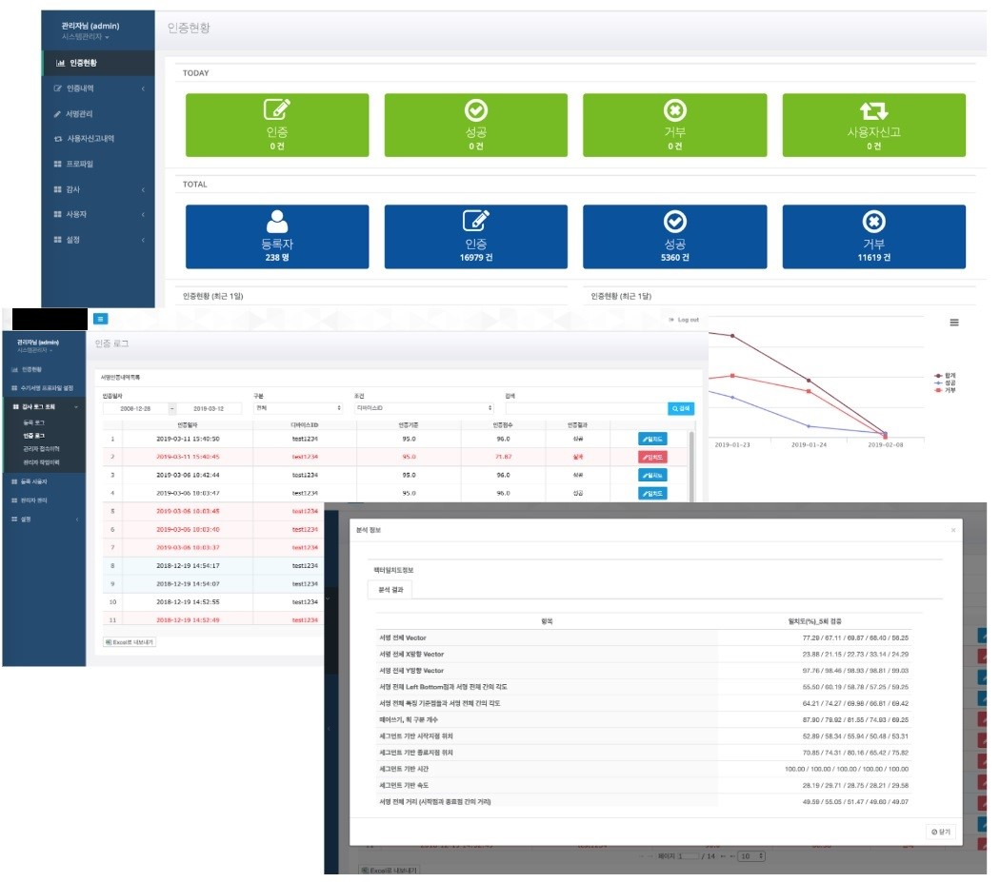

•    **외교부 웹메일 시스템 2차 인층체계 구축 사업 참여**

\-   수행역할(기여도): 개발 및 구축(40%)

\-   기간: 2017.07 ~ 현재

\- 사용기술:

​	1) BackEnd: JAVA 1.7, Spring Framework 3.2.8

​	2) Front End: jQuery, Bootstrap

​	3) DB: mysql


\- 인증 로그 조회 페이지 구현

\- 외교부 인사 VIEW를 통한 조직, 사용자 조회 페이지 구현
 (외교부 인사 VIEW 연동 데몬 구현_crontab)

\- 웹 메일 2차 인증 정책 예외 관리 페이지 구현

\- 인증 서버 정책 관리 페이지 구현

\- 앱 등록 사용자 조회 페이지 구현

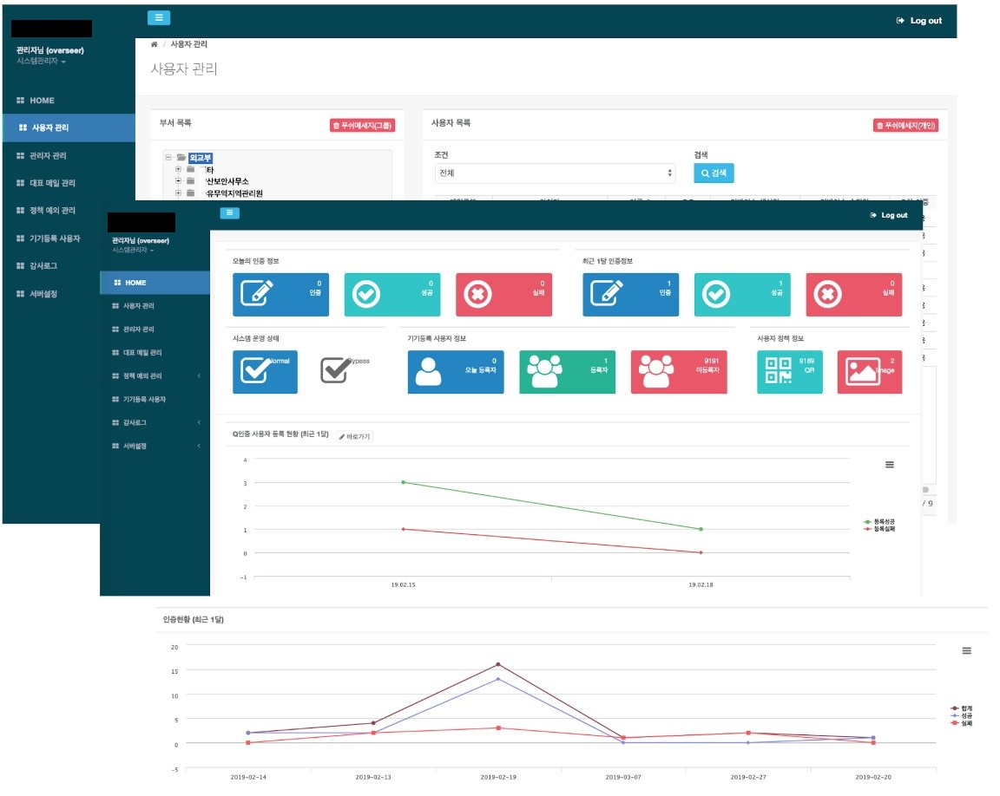

•     **인증 솔루션 데모사이트**

-수행역할(기여도): 개발(90%) 및 유지보수

-사용기술:

​	1) BackEnd : Spring Framework 3.2.8, java 1.7

​	2) FrontEnd : Javascript

-쇼핑몰, 은행관련 사이트 UI 유지보수

-인증 서버 연동

-인증 서버 Rest API call에 따른 Polling 처리 

-인증 결과에 따른 화면 전환

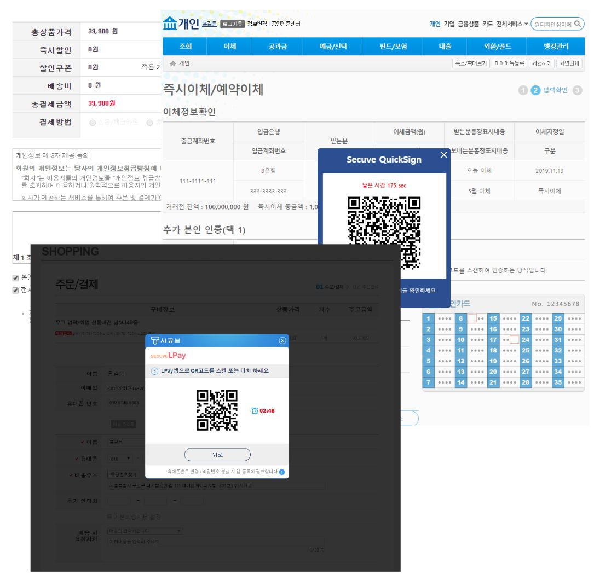

•     **서명 분석 시스템**

-수행역할(기여도): 개발(90%)

-사용기술:

​	1) BackEnd : Spring Framework 3.2.8

​	2) FrontEnd : Javascript, Bootstrap

​	3) DB: mysql

-서명인증API 설계 및 구현

-JNI를 이용한 인증 라이브러리 연동

-서명 인증 로그 데이터 시각화(Highcharts)

-서명 재생, 다시재생, 반복재생, 일시중지 기능 

-서명 인증 분석 데이터 시각화

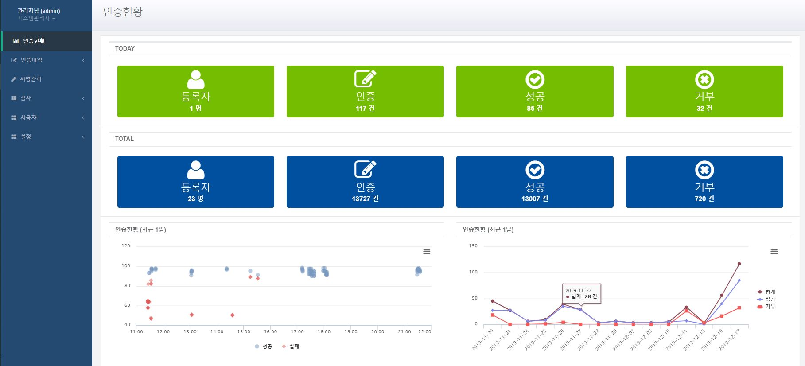

 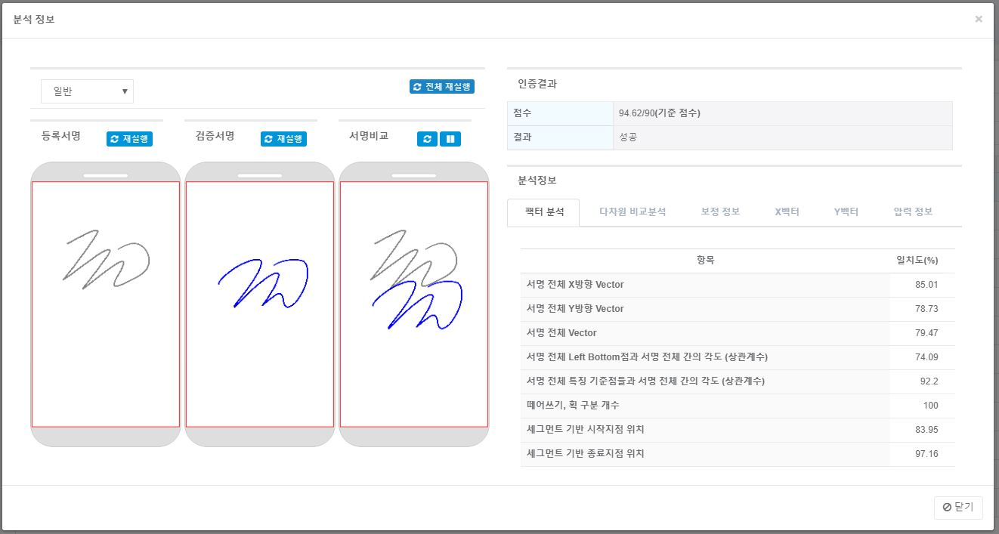

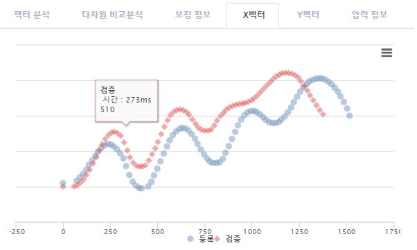

•     **OTP** **인증 관리 콘솔 구현**

-수행역할(기여도): 개발(90%)

- 사용기술:

​    1) BackEnd: JAVA 1.7, Spring Framework 3.2.8, xzing

​	2) Front End: Html, javascript, jQuery, Bootstrap

​	3) DB: mysql, oracle, tibero

\- 사이트에서 필요한 DB vendor 별 쿼리 작성(MyBatis)

\- 인증 로그 조회 및 검색 기능 구현(jqgrid)

\- 사용자 등록 QR 출력 기능 구현(xzing)

\- 관리 서버 접속 이력 페이지 구현

\- 관리 서버 사용자 작업 이력 조회 페이지 구현

\- 사용자 별 2차인증 정책 관리 기능 구현

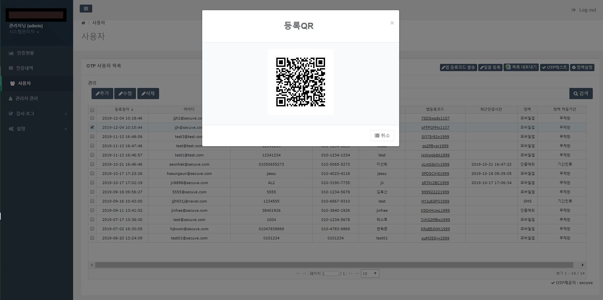

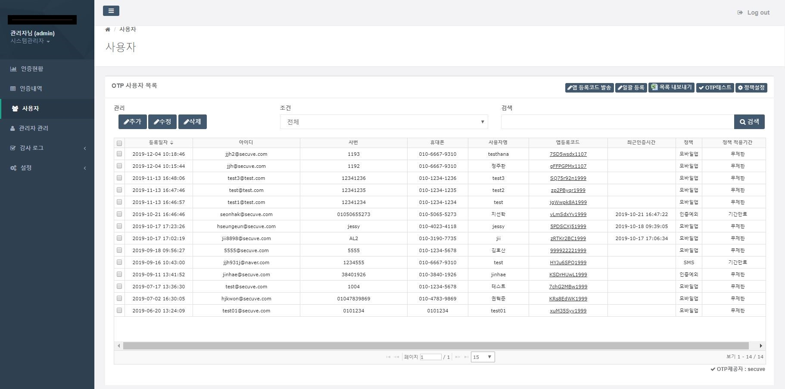

**응용보안팀 (2016.07 - 2016.08)** *대학원 시절 인턴으로 근무

•     **Spring Framework** **세미나**

\- 수행역할(기여도): 연구 및 발표(100%)

\- 사용기술: JAVA

\- DI, AOP 개념 설명

\- Bean 라이프 사이클 개념 설명

\- 대표적인 Spring MVC 어노테이션 설명

 

•     **AOP를 이용한 사용자 사용 정보 시각화**

\- 수행역할(기여도): 개발 및 연구(100%)

\- 사용기술:

​	1) BackEnd: Java

​	2) FrontEnd: javascript, jquery

​	2) DB: Mysql

\- 사용자 게시판 구현(CRUD)

\- AOP 기반 사용자 사용 메뉴 로그 저장

\- 사용자 별 로그인, 사용 메뉴 정보 통계(HighCharts)

 

**빅데이터기술팀 (2016.01 - 2016.06)** *대학원 시절 인턴으로 근무

•     **R엔진 연동을 통한 통계 기능 생성 JAVA 라이브러리 개발**

\- 수행역할(기여도): 개발 및 연구(80%)

\- 사용기술: 

​	1) BackEnd: Java, R

​	2) DB: ElasticSearch

\- elasticsearch 구축 및 java 연동

\- R 통계 기능 연구 

\- R-java 연동 라이브러리 rJava 이용한 연동

\- R 언어 호환 Java 라이브러리 구현(.jar 파일 생성)

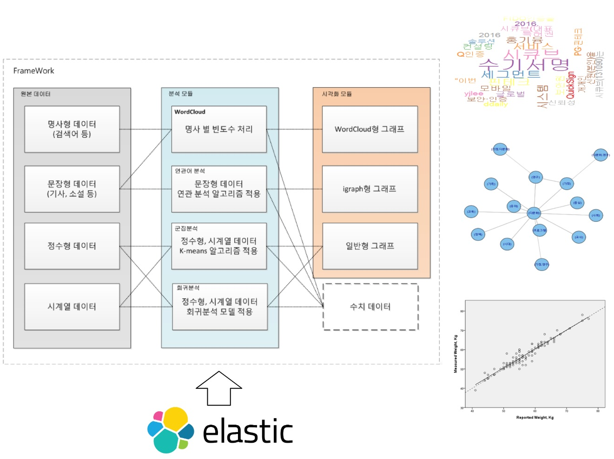

**회귀분석을 이용한 웹 로그 데이터 이상치 탐지 시스템**

\- 수행역할(기여도): 연구 및 개발(90%)

-사용기술:

  1) BackEnd : Java, R, rJava, Logstash

  2) FrontEnd : Javascript, Highcharts

  3) Storage: ElasticSearch

-elasticsearch 구축

-시각화 라이브러리 연구 

-R언어 학습(이상치 분석)

-logstash 플러그인 연동

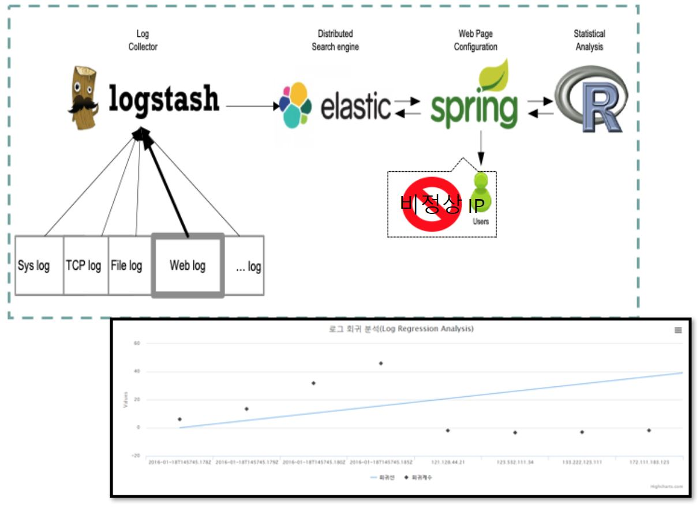

•     **R언어 통계 기능 세미나**

\- 수행역할(기여도): 연구 및 개발(90%)

\- 사용기술: R

\- 명사 별 빈도수 분석

\- 군집분석(k-means)

\- 회귀분석을 이용한 이상치 분석

 

